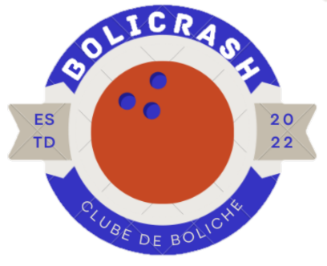

<div style="background-color: #303134; padding: 15px">
<h1 align="center">
    
</h1>

## 💻 Sobre o projeto

O projeto é uma iniciativa desenvolvida como parte do projeto em grupo do 1º módulo do curso <span style="font-size:20px; color: #413fbc; background-color: rgb(255,255,255, 0.5);"> Desenvolvedor Web Full Stack da Resíla Educação</span>. 
<p>
O objetivo é criar um site para um local de entretenimento dedicado ao jogo de boliche. O site fornecerá informações essenciais sobre o estabelecimento, preços, serviços adicionais, promoções especiais. Além disso, o site terá uma seção para os clientes calcularem a quantidade de horas e um formulário de contato, oferecendo uma experiência conveniente e eficiente.
</p>
<p>
O projeto busca utilizar as tecnologias apendidas durante o módulo e as melhores práticas de design para criar uma presença online atraente e funcional para o local de boliche, visando melhorar a experiência dos clientes e atrair novos visitantes. O repositório no GitHub será utilizado para versionar e gerenciar o código-fonte do projeto, permitindo colaboração e controle de versões de forma eficiente.
</p>

Projeto desenvolvido durante o **Módulo 1 - Squad 2** oferecida pela [EBANX - Resília].

## 🛠 Tecnologias

As seguintes ferramentas foram usadas na construção do projeto:

- [HTML][https://www.w3schools.com/]
- [CSS][https://www.w3schools.com/]
- [JavaScript][https://www.w3schools.com/]

## 🚀 Como executar o projeto
```bash
# Clone este repositório
$ git clone https://github.com/Hellraiser997/Trabalho-grupo.git

# Acesse a pasta do projeto no terminal/cmd
$ cd Trabalho-grupo
```

Feito com ❤️ por Dilnae, Felipe, Priscila, Thaise e Victor👋🏽

</div>
